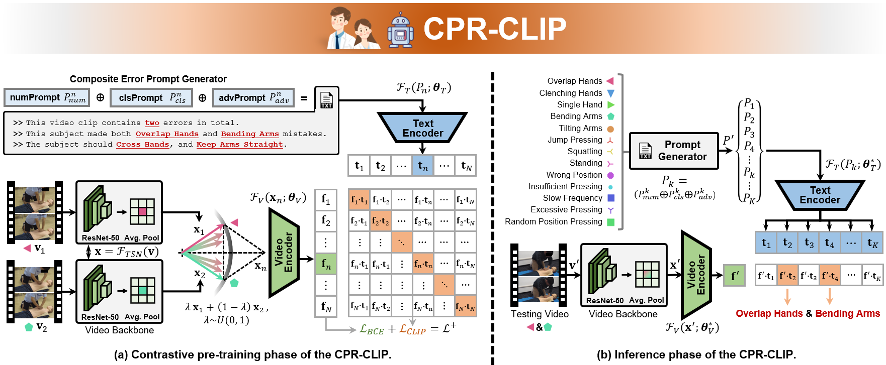
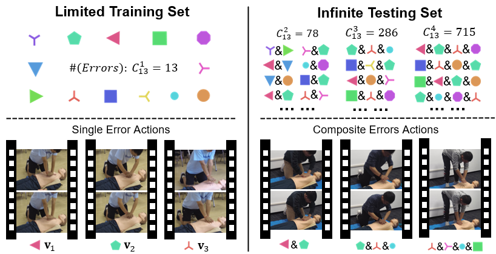

# CPR-CLIP: Multimodal Pre-training for Composite Error Recognition in CPR Training
This repository contains PyTorch implementation for **CPR-CLIP** (Manualscript submited to **IEEE SPL**).

## Abstract
The expensive cost of the medical skill training paradigm hinders the development of medical education, which has attracted rising attention in the intelligent signal processing community.
To address the issue of composite error action recognition in CPR training, this letter proposes a multimodal pre-training framework named CPR-CLIP based on prompt engineering.
Specifically, we design three prompts to fuse multiple errors naturally on the semantic level and then align linguistic and visual features via the contrastive pre-training loss.
Extensive experiments have verified the effectiveness of the CPR-CLIP.
Ultimately, the CPR-CLIP is encapsulated to an electronic assistant, and four doctors are recruited for evaluation.
Nearly four times efficiency improvement is observed in comparative experiments, which demonstrates the practicality of the system.
We hope this work brings new insights to the intelligent medical training system and signal processing community simultaneously.

## Conda Enviroment
```bash
# 1.Clone this repository
git clone https://github.com/Shunli-Wang/CPR-CLIP ./CPR-CLIP
cd ./CPR-CLIP

# 2.Create conda env (Pytorch2.0 will be installed.)
conda create -n CPR-CLIP python=3.10
conda install pytorch torchvision torchaudio pytorch-cuda=11.7 -c pytorch -c nvidia
pip install -r requirements.txt

# 3.Download video features and unzip them into ./pkl/
tar -xzvf TSN-Feature.tar.gz && rm TSN-Feature.tar.gz
mv TSN_Single_Feat.pkl TSN_Composite_Feat.pkl ./pkl/
```

## Datasets
The [CPR-Coach](https://shunli-wang.github.io/CPR-Coach/) dataset provides 14 single-class actions and 74 composite error actions in four different perspectives, containing 4,544 videos. The performance of composite error action recognition is measured through mAP and mmit mAP. 

This repository provides the extracted video TSN features `TSN-Feature.tar.gz` (~33MB). You can download it from [BaiduNetDisk](https://pan.baidu.com/s/1SD2tLt93cyNlo7PcBwTz1g)[star] or Google Drive.

<div  align="center">

</div>

## Training & Testing
- To train the **CPR-CLIP** with TSN as video backbone:
```bash 
CUDA_VISIBLE_DEVICES=0 \
python ./CPR-CLIP.py --exp_name 'CPR-CLIP_w_TSN' --enable_CLIP_loss --eval_CLIP_result
```
- To train the **CPR-CLIP+** with TSN as video backbone:
```bash 
CUDA_VISIBLE_DEVICES=0 \
python ./CPR-CLIP.py --exp_name 'CPR-CLIP+_w_TSN' --enable_CLIP_loss --enable_BCE_loss
```

## Acknowledgements
This project is based on [CLIP](https://github.com/openai/CLIP) and [CPR-Coach](https://shunli-wang.github.io/CPR-Coach/).

If this repository is helpful to you, could you please give this repository a small **STAR**. Thank you!

## Concate
If you have any questions about our work, feel free to contact [slwang19@fudan.edu.cn](slwang19@fudan.edu.cn).
Please continue to pay attention to the subsequent code and data releasing.
